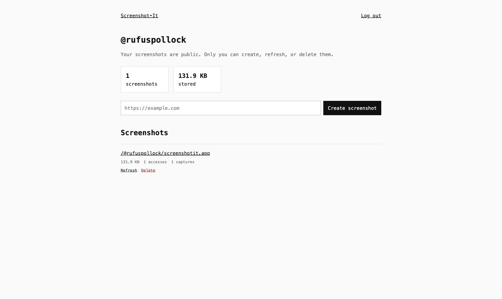

## 2026-08-21 — Account-owned screenshots

GitHub sign-in now gives people a username-based home for their public screenshots. Each account gets scoped storage, quotas, and a dashboard for creating, refreshing, and deleting screenshots, while the images remain publicly accessible at stable `/@username/...` URLs and anonymous routes continue to work as before.

## 2026-02-24 — See what’s being captured

ScreenshotIt added a live leaderboard and recent-activity view, making the most-accessed and newest screenshots visible from the homepage instead of leaving the service as a collection of isolated URLs.

## 2026-02-14 — Faster, richer screenshot history

Screenshots became smaller WebP files, the homepage demo started rotating through real examples, and dated URLs made it possible to retrieve an earlier capture instead of only the latest image.

## 2026-02-11 — Social previews from a URL

ScreenshotIt added social-sized previews, Open Graph and Twitter Card metadata, and shorter URL-first examples so a screenshot can drop directly into a post or link preview.

## 2026-02-04 — A clearer homepage

The homepage was redesigned around a live hero example, a concise URL-to-screenshot explanation, practical API patterns, and a more welcoming path from discovery to the first capture.

## 2026-01-31 — ScreenshotIt.app

The service became ScreenshotIt.app: a Cloudflare-powered screenshot endpoint where the URL itself is the stable image address, with no SDK or API key required for the basic workflow.
